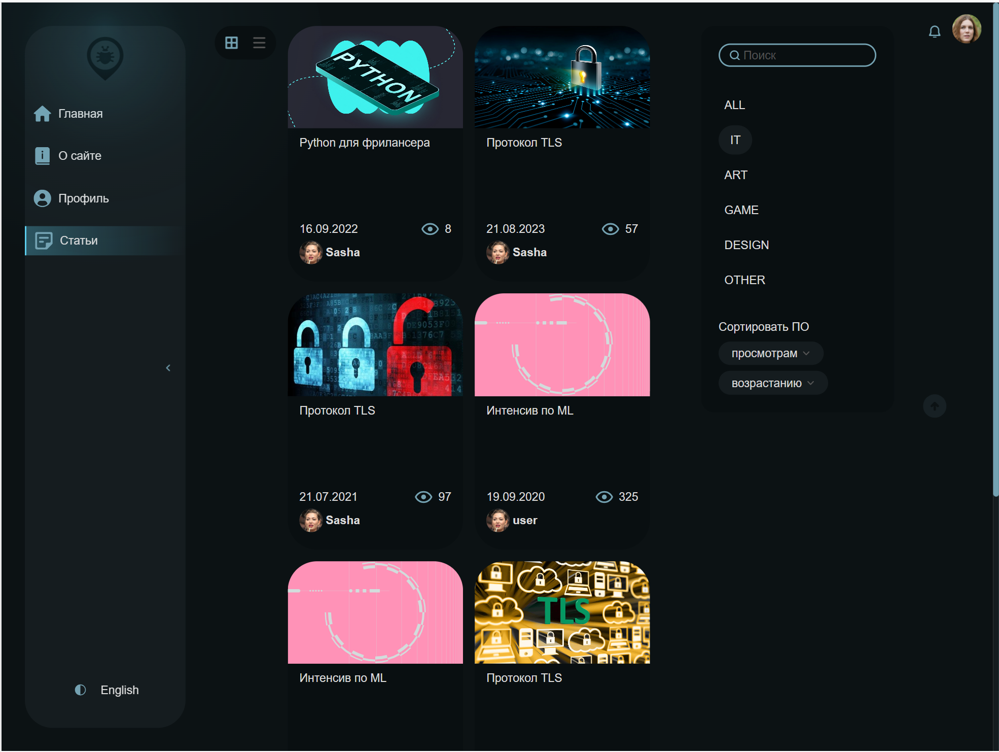
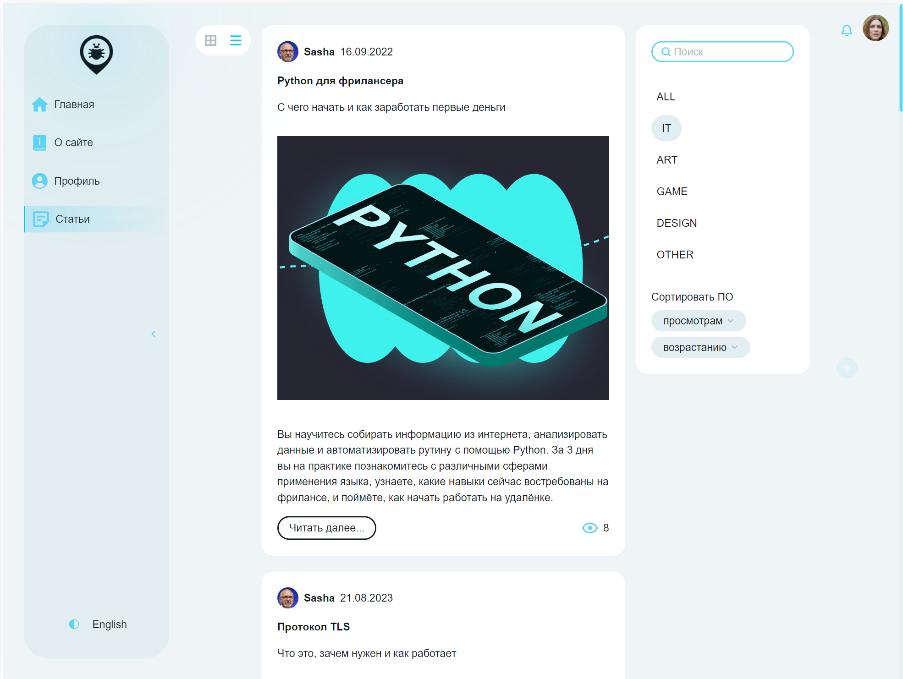
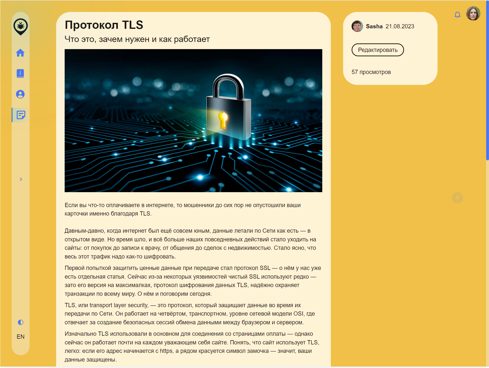
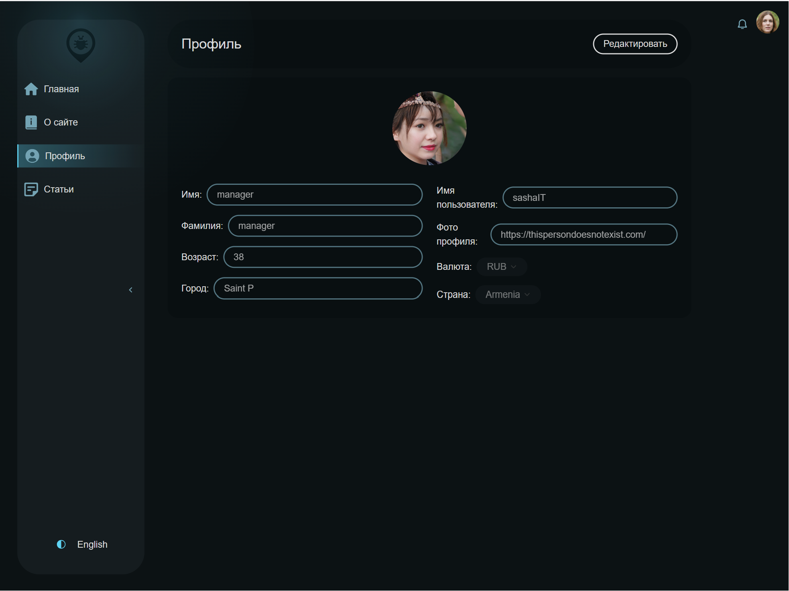

## Project Start

```
npm install - set dependencies
npm run start:dev или npm run start:dev:vite - running server + frontend project in dev mode
```

---

## Scripts

-   `npm run start` - Start frontend project on webpack dev server
-   `npm run start:vite` - Start frontend project on vite
-   `npm run start:dev` - Start frontend project on webpack dev server + backend
-   `npm run start:dev:vite` - Start frontend project on vite + backend
-   `npm run start:dev:server` - Start backend server
-   `npm run build:prod` - Build in prod mode
-   `npm run build:dev` - Build in dev mode (not minimised)
-   `npm run lint:ts` - Check ts files by linter
-   `npm run lint:ts:fix` - Fix ts files with linter
-   `npm run lint:scss` - Check scss files style by linter
-   `npm run lint:scss:fix` - Fix scss files with linter
-   `npm run test:unit` - Run unit tests with jest
-   `npm run test:e2e` - Run e2e tests with cypress
-   `npm run test:ui` - Run screenshot tests with loki
-   `npm run test:ui:ok` - Confirm new screenshots
-   `npm run test:ui:ci` - Run screenshot tests in CI
-   `npm run test:ui:report` - Generate full report for screenshot tests
-   `npm run test:ui:json` - Generate json report for screenshot tests
-   `npm run test:ui:html` - Generate HTML report for screenshot tests
-   `npm run storybook` - Run Storybook
-   `npm run storybook:build` - Build a storybook build
-   `npm run prepare` - Precommit hooks
-   `npm run generate:slice` - Script for FSD slice generation

---

## Project Architecture

The project is written according to the Feature Sliced Design methodology

Link to documentation -
[Feature Sliced Design](https://feature-sliced.design/docs/get-started/tutorial)

---

## Handling Translations

The project uses the i18next library to work with translations. Files with translations are stored in
public/locales.

Documentation i18next - [https://react.i18next.com/](https://react.i18next.com/)

---

## Tests

Read more about the tests - [documentation testing](/docs/tests.md)

---

## Linting

The project uses Eslint to check TypeScript code and StyleLint to check files with styles.

Also, to strictly control the main architectural principles, it uses its own eslint plugin
_eslint-plugin-fsd-01_, which contains 3 rules:

1. path-checker - prohibits the use of absolute imports within a single module
2. layer-imports - checks whether layers are used correctly from the FSD point of view (e.g. widgets
   cannot be used in features and entitites)
3. public-api-imports - allows import from other modules only from public api. Has auto fix.

##### Starting Linters

-   `npm run lint:ts` - Check ts files by linter
-   `npm run lint:ts:fix` - Fix ts files by linter
-   `npm run lint:scss` - Check scss files style by linter
-   `npm run lint:scss:fix` - Fix scss style files by linter

---

## Storybook

Story cases are described for each component in the project. Requests to the server are mocked with
storybook-addon-mock.

A file with storybooks is created next to the component with the extension .stories.tsx

You can run the storybook with the command:

-   `npm run storybook`.

Read more about [Storybook](/docs/storybook.md)

---

## Project Configuration

For development, the project contains 2 configs:

1. Webpack - ./config/build
2. Vite - vite.config.ts

Both builders are adapted to the core features of the application.

The entire configuration is stored in /config

-   /config/babel - babel
-   /config/build - webpack configuration
-   /config/jest - test environment configuration
-   /config/storybook - storybook configuration

The `scripts` folder contains various scripts for refactoring/simplifying code writing/report generation.

---

## CI Pipeline and Pre Commit Hooks

The github actions configuration is in /.github/workflows. All kinds of tests are run in ci, building
project and storybook builds, linting.

In precommit hooks check the project with linters, config in /.husky

---

### Working With Data

Data interaction is done with the redux toolkit. If possible, overused
entities should be normalised using EntityAdapter

Requests to the server are sent using [RTK query](/src/shared/api/rtkApi.ts)

For asynchronous connection of redusers (to avoid pulling them into a common bundle) is used
[DynamicModuleLoader](/src/shared/lib/components/DynamicModulLoader/DynamicModulLoader.tsx)

---

### Working with feature-flags

Feature flags can only be used with the toggleFeatures helper.
An object with options is passed to it.

{
name: name of feature-flag,
on: function that will be triggered when the feature is switched on
of: function that will run after the feature is switched off
}

To automatically remove a feature, use the script remove-feature.ts,
which takes 2 arguments

1. The name of the feature-flags to be removed
2. State (on\off)

---

## Entities

-   [Article](/src/entities/Article)
-   [Comment](/src/entities/Comment)
-   [Counter](/src/entities/Counter)
-   [Country](/src/entities/Country)
-   [Currency](/src/entities/Currency)
-   [Notification](/src/entities/Notification)
-   [Profile](/src/entities/Profile)
-   [Rating](/src/entities/Rating)
-   [User](/src/entities/User)

## Features

-   [AddCommentForm](/src/features/AddCommentForm)
-   [ArticleEditForm](/src/features/ArticleEditForm)
-   [ArticlePageGreeting](/src/features/ArticlePageGreeting)
-   [ArticleRating](/src/features/ArticleRating)
-   [ArticleRecommendationsList](/src/features/ArticleRecommendationsList)
-   [ArticleSortSelector](/src/features/ArticleSortSelector)
-   [ArticleTypeTabs](/src/features/ArticleTypeTabs)
-   [ArticleViewSelector](/src/features/ArticleViewSelector)
-   [AuthByUsername](/src/features/AuthByUsername)
-   [AvatarDropdown](/src/features/AvatarDropdown)
-   [EditableProfileCard](/src/features/EditableProfileCard)
-   [LangSwitcher](/src/features/LangSwitcher)
-   [NotificationButton](/src/features/NotificationButton)
-   [ThemeSwitcher](/src/features/ThemeSwitcher)
-   [ScrollSave](/src/features/ScrollSave)
-   [ScrollToTopButton](/src/features/ScrollToTopButton)
-   [UiDesignSwitcher](/src/features/UiDesignSwitcher)

---

## Results

<p>
   
   
   
   
</p>
